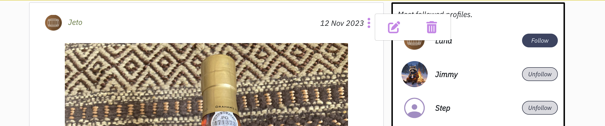
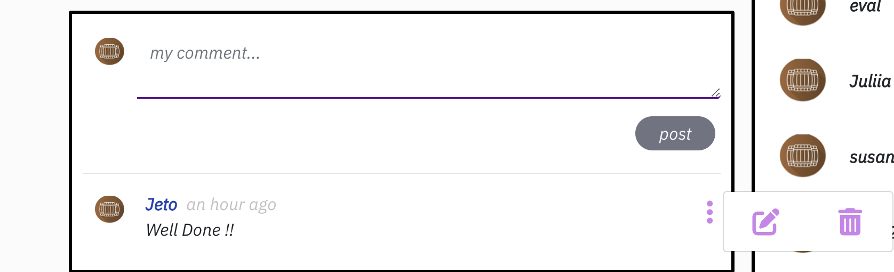
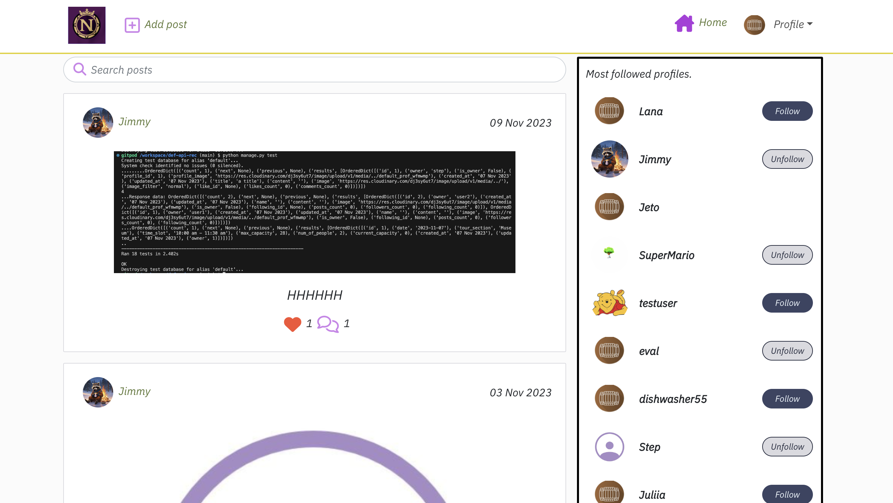

# Beta-P5

## Description.
Beta-P5 is a social media platform dedicated to showcasing a unique private collection detailing wine making before the advent of electricity. The platform allows users to immerse themselves in the rich history, share their experiences in the form of images and stories, and interact with a community of like-minded enthusiasts. After a physical visit to the museum, users can share their stories and experiences with the community.

## Users Story

# Getting Started

## Feature 

To begin interacting with the platform, users need to sign up. Once registered, they can delve into the world of vintage wine making, book visits, post images with captions, and engage with other members through likes and comments.

- When the user is logged out, the following icons will show:
    - Home
    
    - Sign In (the user in order to be able to post, comment, like, booking a visit, must sign in)
    
    - Sign Up
    

- If the user is using a mobile or small screened device, a burger menu will show

### NavBar.js

- Navigation Bar. This allows the user to navigate consistently throughout the site. The Nav Bar will show two different sets of icons depending on whether the user is logged in or logged out. 
  - When the user is logged in, the following icons will show:
      - Add (add a post)
      - Home  (see all posts uploaded, with most recent appearing first)
      - Profile ( with the Avatar on his left side), the profile will have a      dropdown menu with the following 
        link:
      
       - Profile
       - Feed (see the posts from users that I follow)
       - Liked
       - Booking
       - Sign Out  
  

### Profile 
   - In here you can see the page dedicated to the user wit different 
   section:
  
     * Profile Name 
     * Number of posts
     * Number of Followers 
     * Number of Following 
     * Add post
  
  - Most followed profiles, Follow/Unfollow profiles - This shows a list of the 10 most followed profiles on the website, users can follow or unfollow   accounts.
   

   

   - on the Top right section there is a "ThreeDot" icon once clicked
    it will display some options :
      
      * Edit profile 
       in here the user is allowed to change his Avatar and add a small Bio if he likes.
        
      * Change username ( the user can change his first name, last name andd username )
        
      * Change password 
       

### Add post
  - Add (add post) - On this page, users can upload a post. There is frontend and backend validation to check the data provided, to see if the file is an image or not. If there is a file at all. If the required fields are filled. If there are any errors, there are Alert banners which highlight the field with the error.
  - 
  
  - Popular Profile - This display all the user with most followers. Located on the right side of the page.

  - 

  - Edit Post - On this page, users can edit a post. The fields are automatically filled with the data the post already has. There is frontend and backend validation to check the data provided, to see if the file is an image or not. If there is a file at all. If the required fields are filled. If there are any errors, there are Alert banners which highlight the field with the error. User's can edit the post from anywhere on the platform where the user can see their own post.
  - 
  Also the user will have a third opinion to preview his post before it will be post it.
  - 
- Delete Post - This simple button deletes the post 

- Comment - this feature is similar to the post's logic, the user can create, edit or delete a comment.

### Feed 

- This is where the users can see all the posts from the user's they follow. It has all the same features of the Discover Page, but is filtered by the profiles that you follow. Users can only see the ba

###  Likes 
- This feature is a simple like button, so users can share their encouragement for posts they enjoy. Users must be logged in to user this function.
  
  

### Bookings

- Our Service - Is  what we stand for, a small introduction of what we believe and the message we wanna spread with our audience.
 

- Booking System: Allows users to book visits to the museum. Here's  
   how it works:
   - Log in to the system.
   - Choose a date (Sundays and Mondays are unavailable).
   
   - Select tour section:
     * Museo
     * Photo Gallery
     * Under Ground Wine Tanks
     * Private Garden 

   -  Select a time slot:
     *  10:00am - 11:30am
     *  12:00pm - 1:30pm
     *  4:00pm - 5:30pm
     * 6:00pm - 7:30pm

- Specify the number of attendees (between 1 and 28). The maximum capacity for each time slot is 28 visitors.

- Upon successful booking, users receive a confirmation message along  with a delete button, allowing them to cancel their reservation if necessary.

- delete message will be displayed once the user will decide to retrieve ve his request

### Structure 
React is based on components. So within the display view, many components can make up the whole. See the [Features](#features) section for screenshots of the below components in action, along with the wire-frame for a simple sketch of how they look.
- Navigation Bar - This will feature throughout the entire site, staying consistent for the user.
- Most Followed Accounts - Most Followed Accounts section will appear on every page (except the add/edit post page), below the navbar (on mobile/small screen devices) or to the right of the post(s) (on larger screens/desktops).
- Post (when in Home, Feed and Profile pages) - Each post will appear displaying the Image, Title, Travel Type and Summary, along with the Like icon and count, Comment Icon and count and the Bookmark Icon to save the bookmark. It will not display the main content of the post. On the Feed and Discover pages, the page has an Infinite Scroll feature that means more posts can be loaded without pagination (only if there are more than 10 posts on a page).
- Post (once clicked into the post or clicking on the comment button) - Within the individual post page, the Post will now include the main content of the post, where the owner of the post can write more content for their post.
- Comments - The comments section only appears on the individual post page, where users can now interact with the post and share their views with the owner of the post publicly. This has Infinite Scroll, which loads older comments as you scroll down (only if there are more than 10 comments on a post).
- Edit Post Dropdown - This dropdown menu will display on each post where there are current logged in user is the owner of the post on screen.
- Edit Profile Dropdown - This dropdown menu allows the user to edit the profile details (username, password & bio) only if the current logged in user is the owner of the profile in view.
- Visiting - this will be a page where the user is able to create a booking choosing date, tour section, time slot, number of people.
- Visiting delete - the user will be able to create and delete his booking as his need.

## Wire-frame

# Future Features

- Add a Gallery with the images of the different tour sections.
- Add a Contact form.
- Add a chat bot to be able to answers some questions from the users.
- Create a Edit form for the booking.

# Validations
  All of my validation are effected by the lock-down error I will explain it later on my file.
  

  
  
  

## Technology 

 - HTML
 - CSS 
 - REACT.JS 

 ### Acknowledgments
The project was inspired by the walkthrough projects from the Code Institute. It has been adapted to cater to the needs of the family museum.

## Front-end Credits 
The code for the frontend of this project was inspired by the fantastic walkthrough project conducted by the Team. Was the perfect grounding for my project to build.

# Errors

all the website work fine.

I would like to point that I am getting some warning on my console.

I had a session with the mentor the 27/09 and he suggested me to ask help to the tutor so i have done that too.

Once the tutor took a look he sent me some screenshot where it didn’t have the warning.

 - In the screenshot above is the warning a get on my device.

 - In this one is the console of the tutor once after have created an account and try to post or booked a visit.