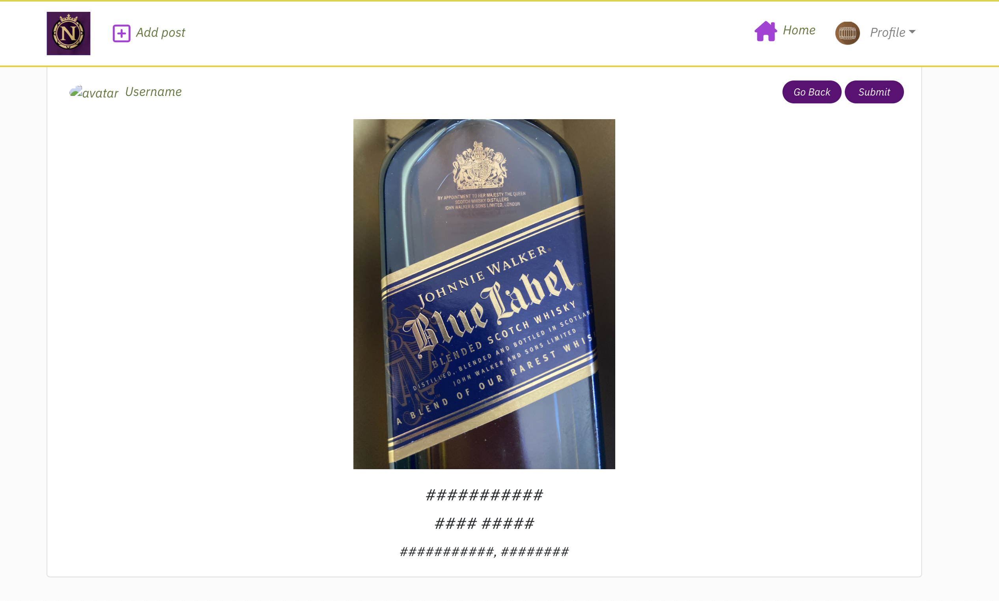

# Beta-P5

## Description.
Beta-P5 is a social media platform dedicated to showcasing a unique private collection detailing wine making before the advent of electricity. The platform allows users to immerse themselves in the rich history, share their experiences in the form of images and stories, and interact with a community of like-minded enthusiasts. After a physical visit to the museum, users can share their stories and experiences with the community.

## NavBar.js

* AS illustrated above you can clearly see displayed the logo on the left side and the icon to add a post.
* From the middle of the screen movie to the right you can see all the set of icon
    - Home
       - In this section the user will find the story of the the Museo, below that it will star the list of post.
    - Feed 
    - Liked 
      - Both {feed and liked} works very similar, they display the likes the user have put on the post and the feed are the post the user has posted.
    - Booking
    - Sign Out 
    - Profile 

  #  Profile 
   - In here you can see the page dedicated to the user wit different 
   section:

     * Profile Name 
     * Number of posts
     * Number of Followers 
     * Number of Following 

   - on the Top right section there is a "ThreeDot" icon once clicked
    it will display some options :
      
      * Edit profile 
       in here the user is allowed to change his Avatar and add a small Bio if he likes.
      * Change username 
      * Change password 

      both have the only scope to do what it says.

# Getting Started
To begin interacting with the platform, users need to sign up. Once registered, they can delve into the world of vintage wine making, book visits, post images with captions, and engage with other members through likes and comments.

### Structure 
React is based on components. So within the display view, many components can make up the whole. See the [Features](#features) section for screenshots of the below components in action, along with the wire-frame for a simple sketch of how they look.
- Navigation Bar - This will feature throughout the entire site, staying consistent for the user.
- Most Followed Accounts - Most Followed Accounts section will appear on every page (except the add/edit post page), below the navbar (on mobile/small screen devices) or to the right of the post(s) (on larger screens/desktops).
- Post (when in Home, Feed and Profile pages) - Each post will appear displaying the Image, Title, Travel Type and Summary, along with the Like icon and count, Comment Icon and count and the Bookmark Icon to save the bookmark. It will not display the main content of the post. On the Feed and Discover pages, the page has an Infinite Scroll feature that means more posts can be loaded without pagination (only if there are more than 10 posts on a page).
- Post (once clicked into the post or clicking on the comment button) - Within the individual post page, the Post will now include the main content of the post, where the owner of the post can write more content for their post.
- Comments - The comments section only appears on the individual post page, where users can now interact with the post and share their views with the owner of the post publicly. This has Infinite Scroll, which loads older comments as you scroll down (only if there are more than 10 comments on a post).
- Edit Post Dropdown - This dropdown menu will display on each post where there are current logged in user is the owner of the post on screen.
- Edit Profile Dropdown - This dropdown menu allows the user to edit the profile details (username, password & bio) only if the current logged in user is the owner of the profile in view.
- Visiting - this will be a page where the user is able to create a booking choosing date, tour section, time slot, number of people.
- Visiting delete - the user will be able to create and delete his booking as his need.

# Features

- Popular Profiles: Showcase users with the highest followers and most 
   likes.

- Booking System: Allows users to book visits to the museum. Here's  
   how it works:
   - Log in to the system.

  - Choose a date (Sundays and Mondays are unavailable).
 -  Select a time slot:
     *  10:00am - 11:30am
     *  12:00pm - 1:30pm
     *  4:00pm - 5:30pm
     * 6:00pm - 7:30pm

- Specify the number of attendees (between 1 and 28). The maximum capacity for each time slot is 28 visitors.

- Upon successful booking, users receive a confirmation message along  with a delete button, allowing them to cancel their reservation if necessary.

# Validations
  All of my validation are effected by the  lockdown error I will explain it later on my file.
  

  
  
  

## Technology 

 - HTML
 - CSS 
 - REACT.JS 

 ### Acknowledgments
The project was inspired by the walkthrough projects from the Code Institute. It has been adapted to cater to the needs of the family museum.

## Front-end Credits 
The code for the frontend of this project was inspired by the fantastic walkthrough project conducted by the Team. Was the perfect grounding for my project to build.

# Errors

all the website work fine.

I would like to point that I am getting some warning on my console.

I had a session with the mentor the 27/09 and he suggested me to ask help to the tutor so i have done that too.

Once the tutor took a look he sent me some screenshot where it didn’t have the warning.

 - In the screenshot above is the warning a get on my device.

 - In this one is the console of the tutor once after have created an account and try to post or booked a visit.